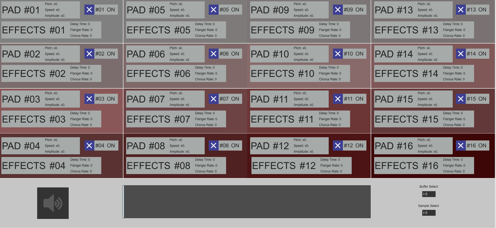
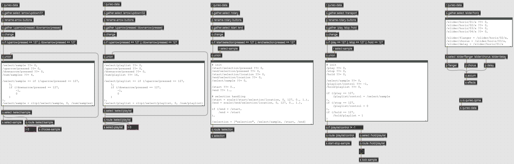
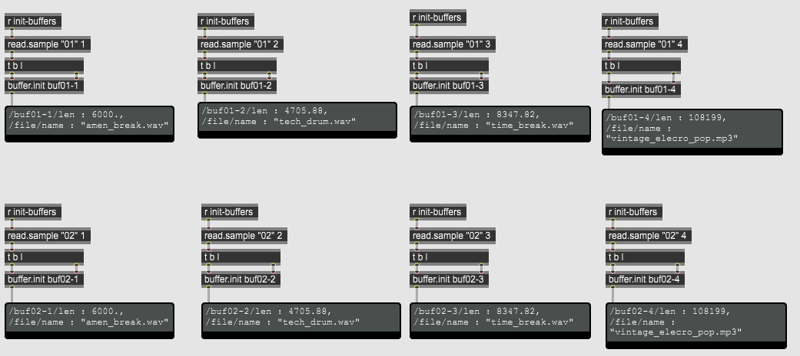
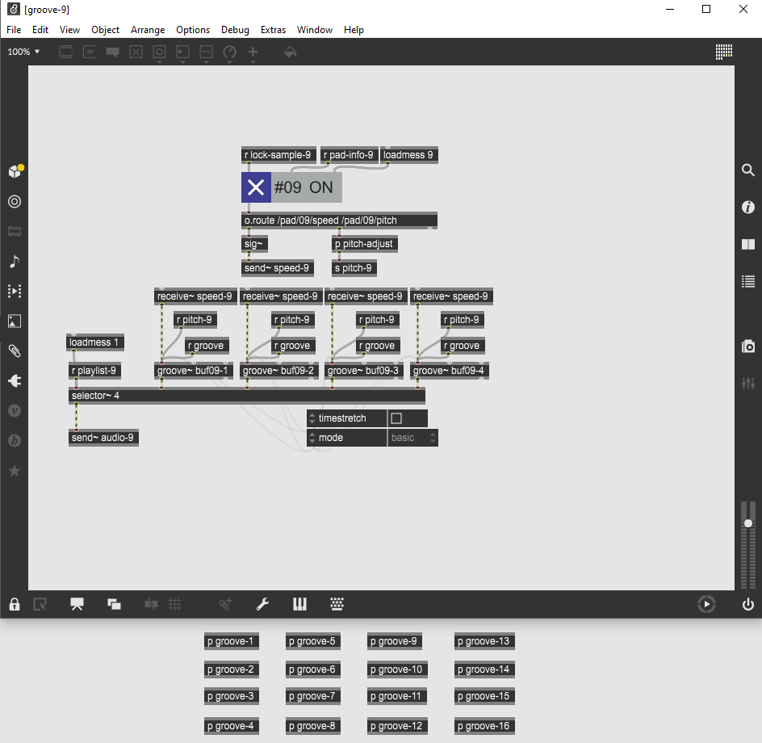

# QuNeo Digital Instrument (Midterm Project)

## Overview

My midterm project consisted of creating a Sample Mixer and Modulator instrument using a [QuNeo Drum Pad](https://www.keithmcmillen.com/products/quneo/).

Each of the 16 drum pads of the QuNeo device represent a collection of sounds called a "soundscape": this soundscape consists of up to 4 samples to be modulated together (such as changing the pitch, tempo, or applied effects). A total of 64 sounds can be loaded into the instrument (16 soundscapes with up to 4 sounds each).

As the performer gradually presses on a drum pad, the amplitude of that soundscape will increase. This allows the performer to mix the soundscapes together by pressing on different sets of the drum pads in tandem.

Each soundscape can be independently modulated, which includes changing the pitch, the speed (tempo adjustment without pitch change), and the amplitude. Each soundscape also has an effects chain with delay, flanger, and chorus settings; these effects can too be independently modulated for each soundscape. Each of these parameters are modulated via the QuNeo's sliders; the rate of change is determined by the pressure the performer applies to buttons (lighter pressure results in slower changes and vice versa).

This instrument allows a performer to group sounds into categories to be modulated together, and then blend these soundscapes together in a performance environment.

## Motivation

Up until this point, my experience with music programming mostly mostly involved staying within the Max/MSP environment. This project was an exploration on how raw external device data can be used in creative ways to control a Max patch as opposed to the typical keyboard and mouse setup.

The goal for the Instrument was to provide the performer the ability to blend and modulate a large collection of samples in real-time to create unique combinations of sounds. The QuNeo external device provided an excellent interface for handling subtle and expressive playing due to its ability to detect pressure for each pad and slider.

## Technical Details

### Presentation Space

The Presentation view of the patch shows each of the 16 soundscapes and how they are being modulated in real-time. This includes the speed and pitch adjustment of each soundscape along with any effects that are being applied to the it.

## QuNeo Device Handler

QuNeo raw data is packaged as an OSC bundle and routed throughout the patch to detect button presses and pressure, which correspond to actions like playing a soundscape, changing the speed or pitch of a selected soundscape, or adding effects to a selected soundscape.

## Using Samples

There are 64 buffers that samples can be loaded into. Each group of 4 buffers is associated with one drum pad.

Each `buffer~` corresponds to a `groove~` object. Each bank of 4 grooves that correspond to a single soundscape can be have their speed, pitch, and amplitude modulated independently from other soundscapes.

## Effects Modulation

Each of the 16 soundscapes has its own effects chain. Effects can be independently applied and modulated in real-time for each of the 16 soundscapes.

