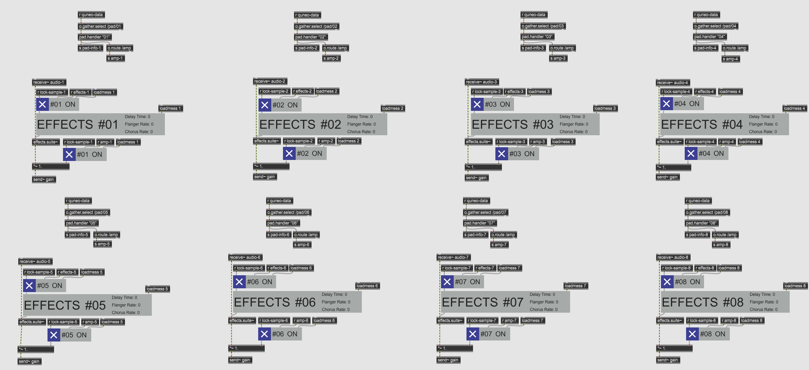

# QuNeo Digital Instrument (Midterm Project)

My midterm project consisted of using a [QuNeo Drum Pad](https://www.keithmcmillen.com/products/quneo/)

## Presentation Space

## QuNeo Device Handler

## Using Samples

## Effects Modulation

