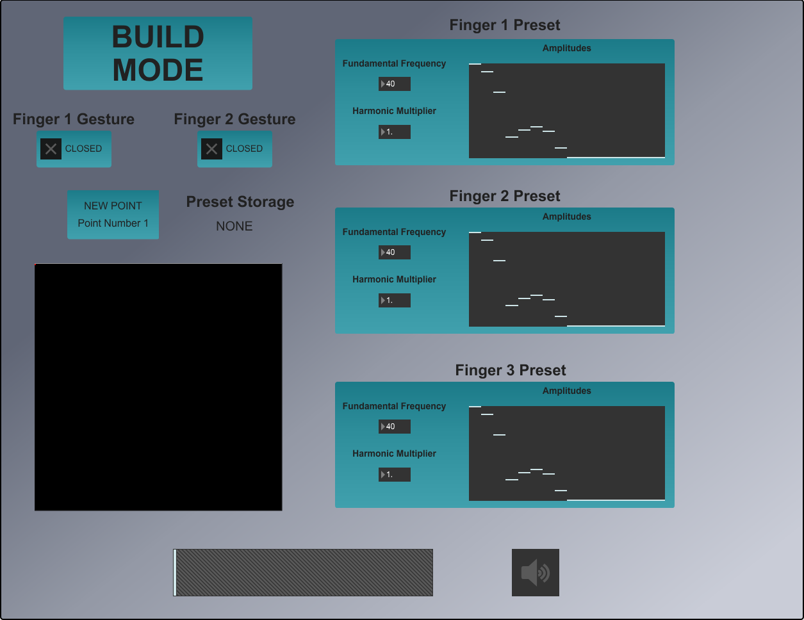
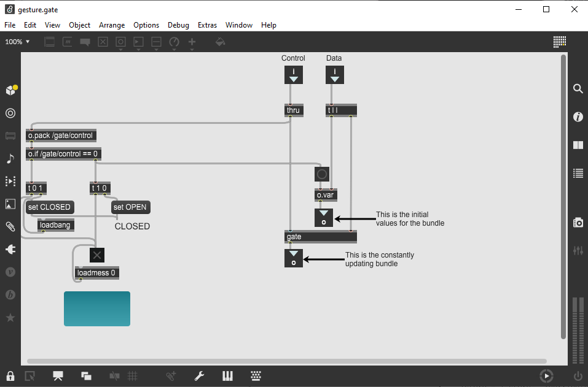
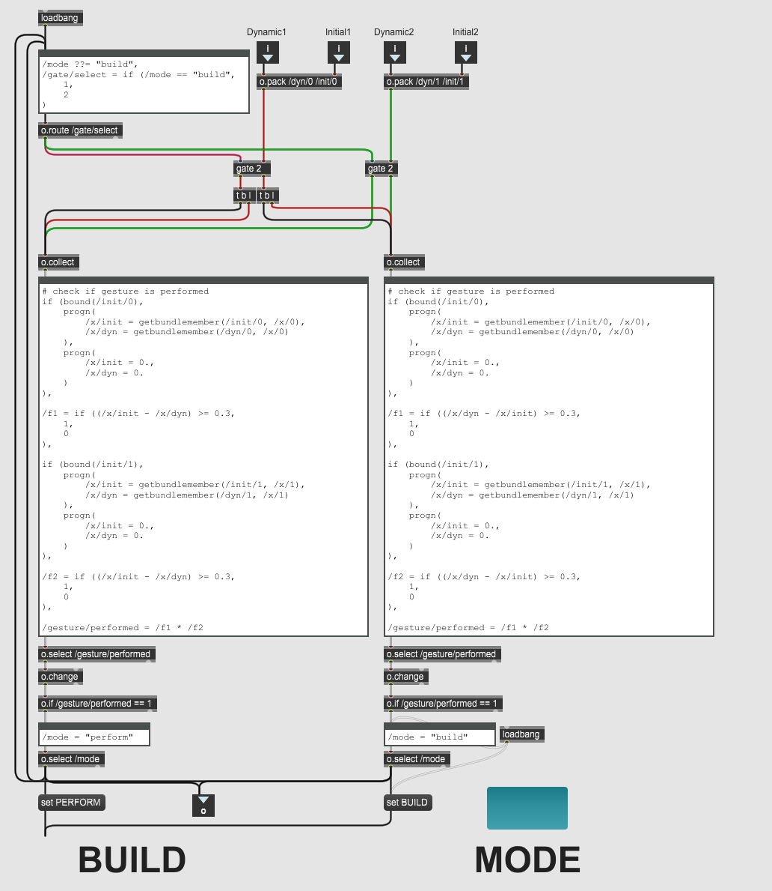
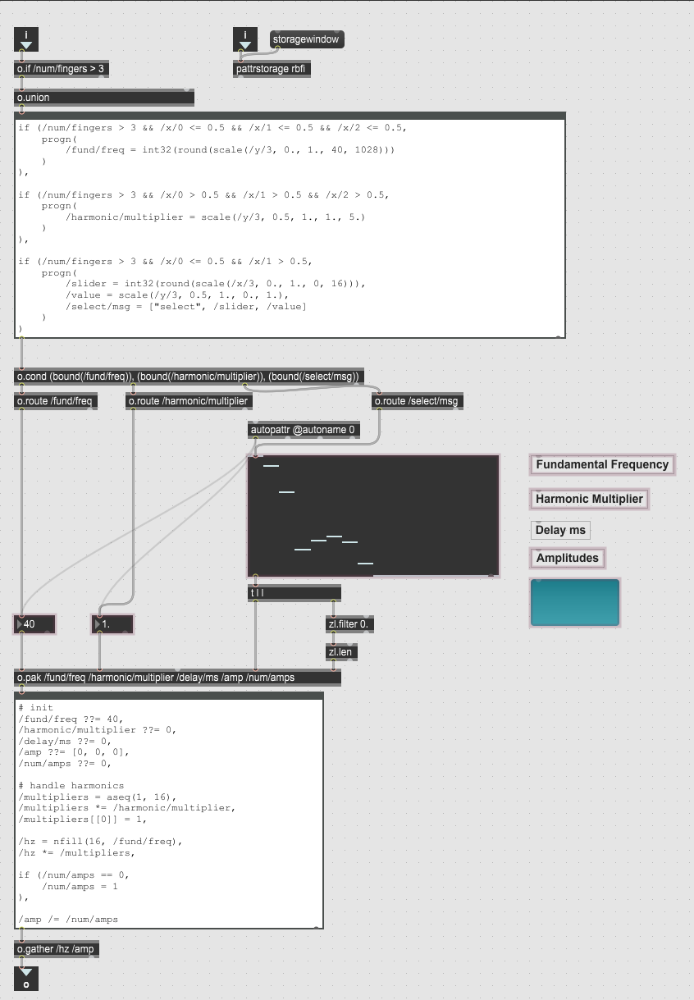
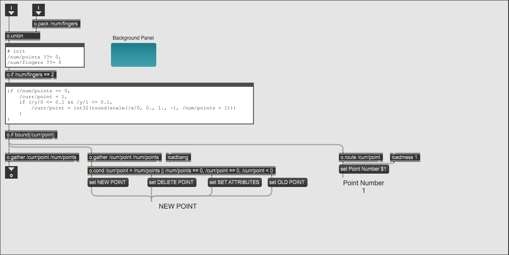
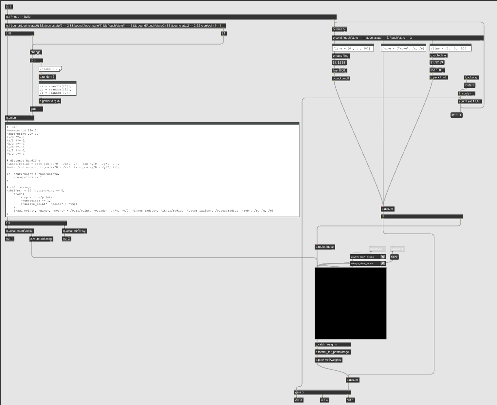

# Wacom Digital Instrument (Final Project)

## Overview

My final project was a Digital Instrument focused around customization of "Performance Spaces" through finger gestures performed on a [Wacom Drawing Tablet](https://www.wacom.com/en-us/products/pen-tablets/wacom-intuos-pro).

## Motivation

The origin of this project came from a mix of two sources:

1. Translating every day actions and movements into musical ability
2. Having the instrument evolve each time the performer picks it up

The former is achieved by utilizing gestures that one might perform on an iPhone, iPad or touchscreen device, such as double-tapping, swiping with one, two, or three fingers, and pinching the screen. These gestures that most are now accustomed to translate into actions such as placing RBFI points, adjusting their inner and outer circles, selecting and loading presets, changing the fundamental frequency or harmonic content of a preset, and so on. In performance mode, the gestures change to be more fluid and reminiscent of finger-painting.

The latter is achieved by allowing the performer to place down points in the RBFI space that correspond to specific sounds that are constructed by the performer. The harmonic content of these sounds and their placement within the RBFI space is decided by the performer and can be saved as a preset to be recalled later. This allows the performer to build unique performance spaces where the sounds blend in different ways depending on their spatial relationship. This allows the instrument to be highly customizable based on the performer's needs. This was my initial exploration in this concept and was the genesis for my future love of Eurorack and modular synthesis.

## Technical Details

### Presentation Space

### Gesture Handling

### Preset Handling

### RBFI Handling

### Performance Blending using Poly~

