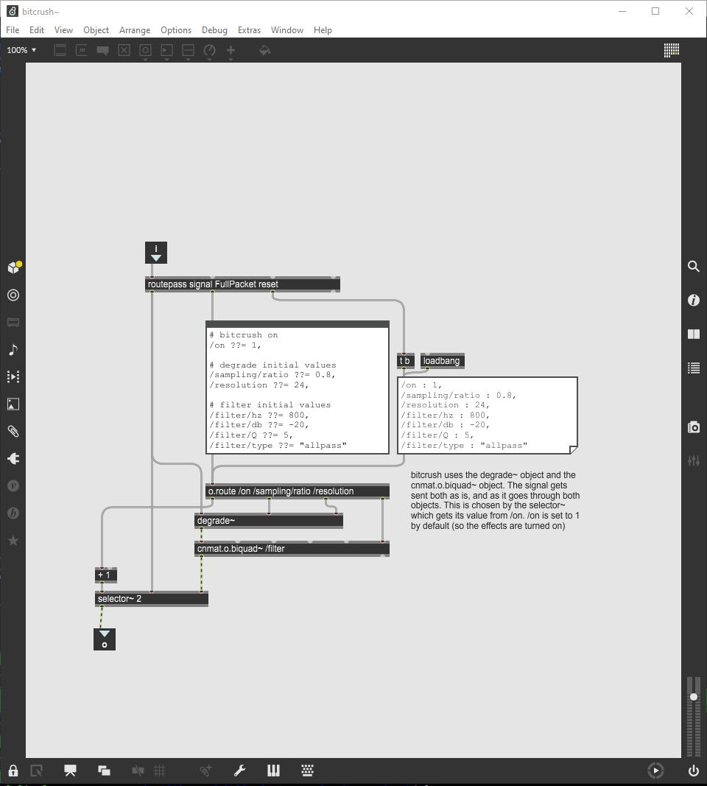
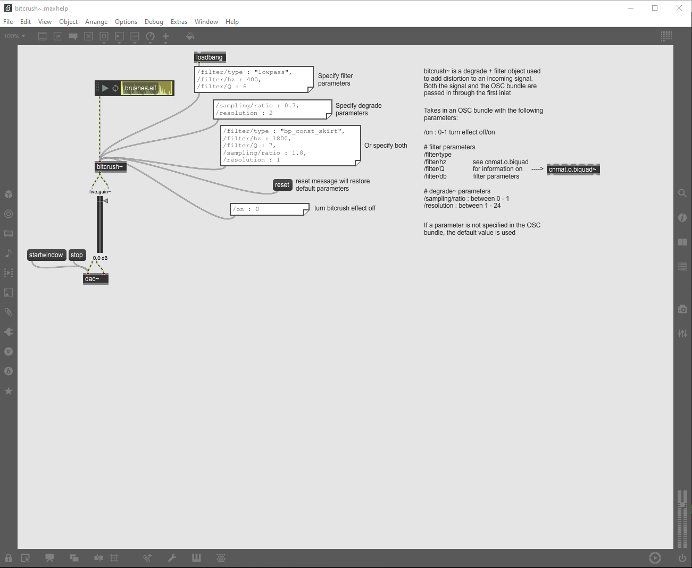
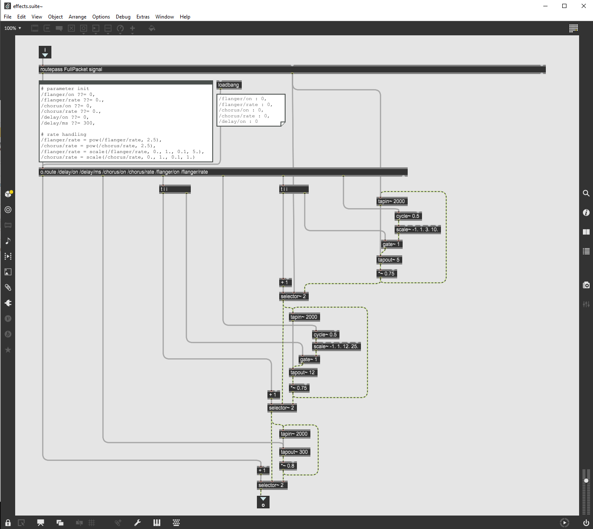
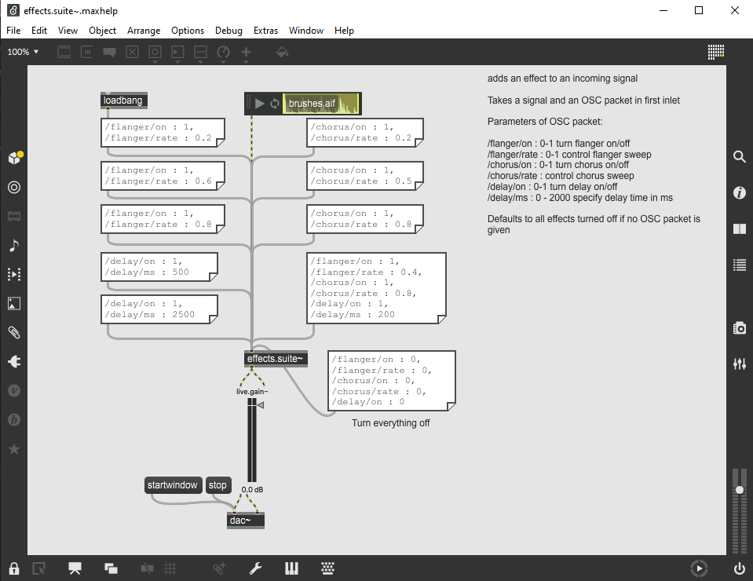
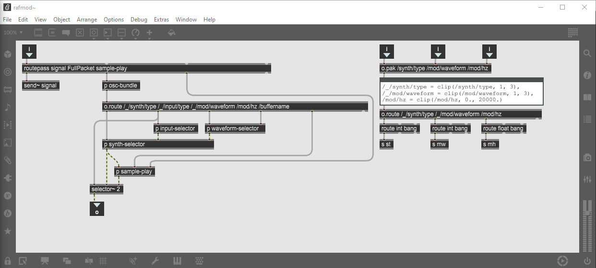
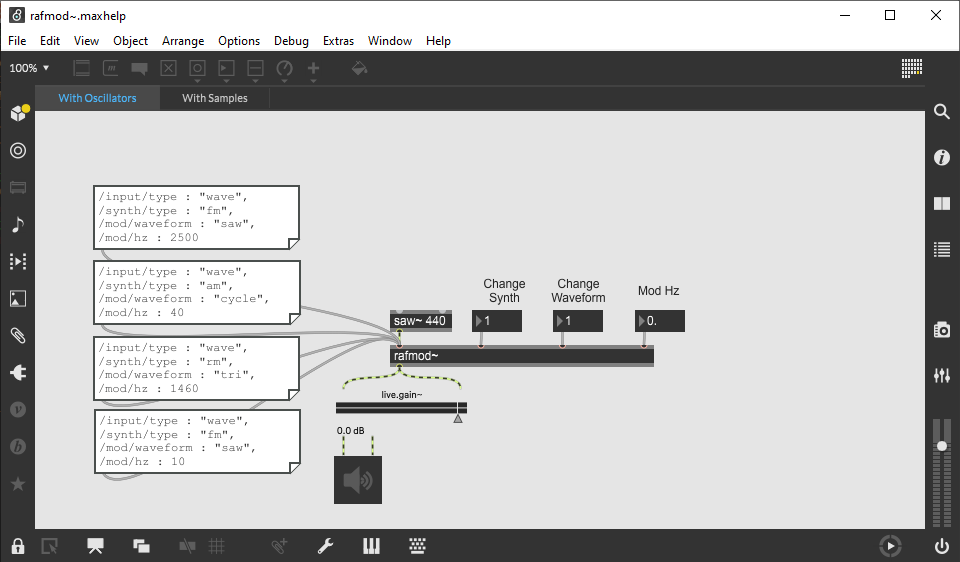

# Effects Patches

This directory contains abstractions for creating effects, like distortion, chorus/delay, and AM/FM. These effects are used in both the Midterm and Final projects. All of the abstractions are controlled via OSC bundles.

## BitCrush

The `bitcrush~` abstraction adds distortion to an input signal. It is a wrapper around the `degrade~` and `cnmat.o.biquad~` objects

### bitcrush~ patch

### bitcrush~ help patch

## Effects Suite

The `effects.suite~` abstraction implements delay-based effects: a standard delay, flanger, and chorus effect. Each effect can be independently enabled and controlled.

### effects.suite~ patch

### effects.suite~ help patch

## RAFMod

The `rafmod~` abstraction implements **R**ing modulation, **A**mplitude modulation, and **F**requency modulation (hence RAF mod). `rafmod` accepts an input oscillator or audio file.

### rafmod~ patch

### rafmod~ help patch

